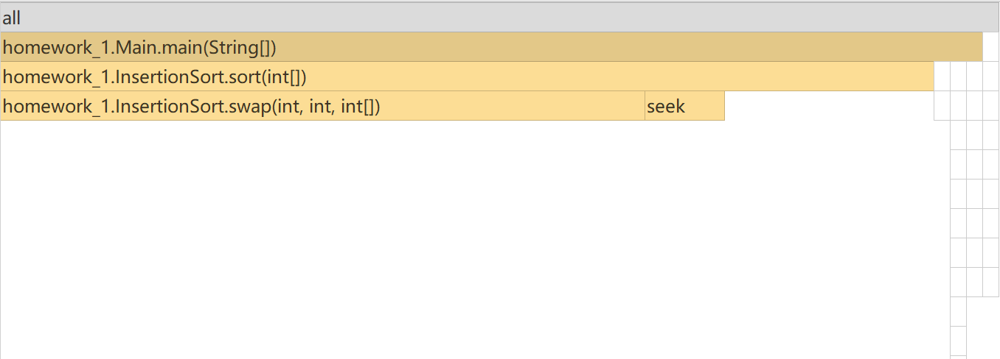
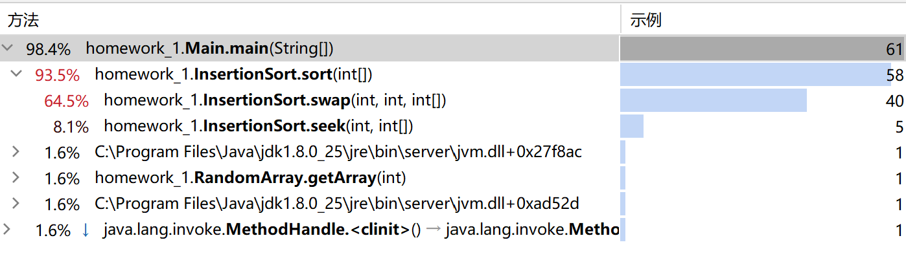

# 插入排序耗时分析

## 插入排序

插入排序的基本思想是将一个记录插入到已经排好序的有序表中，从而一个新的、记录数增1的有序表在其实现过程使用双层循环，外层循环对除了第一个元素之外的所有元素，内层循环对当前元素前面有序表进行待插入位置查找，并进行移动。

插入排序的平均时间复杂度也是`O(n^2)`，空间复杂度为常数阶`O(1)`，具体时间复杂度和数组的有序性也是有关联的。插入排序中，当待排序数组是有序时，是最优的情况，只需当前数跟前一个数比较一下就可以了，这时一共需要比较N-1次，时间复杂度为`O(N)`。最坏的情况是待排序数组是逆序的，此时需要比较次数最多，最坏的情况是`O(n^2)`。

假设前面n-1(其中n>=2)个数已经是排好顺序的，现将第n个数插到前面已经排好的序列中，然后找到合适自己的位置，使得插入第n个数的这个序列也是排好顺序的。按照此法对所有元素进行插入，直到整个序列有序。

## 代码及分析
```Java
public class InsertionSort {

    //交换元素
    private void swap(int i, int j, int[] arr) {
        arr[j] ^= arr[i];
        arr[i] ^= arr[j];
        arr[j] ^= arr[i];
    }

    //寻找合适插入位置
    private int seek(int i, int[] arr) {
        int proper = i;
        for (int j = i; j > 0; j--) {
            if (arr[i] < arr[j - 1]) {
                proper = j - 1;
            } else {
                break;
            }
        }
        return proper;
    }

    //将数值交换到合适位置
    public void sort(int[] arr) {
        int n = arr.length;
        for (int i = 0; i < n; i++) {   // 寻找元素 arr[i]合适插入位置
            int proper = seek(i,arr);
            for (int j = i; j > proper; j--) {
                swap(j, j - 1, arr);
            }
        }
    }

}
```
插入排序分为两个阶段。查找和交换，分别用`seek`和`swap`函数表示。
- seek() 
  
  在进行第i个元素的插入操作时，前n-1个元素已完成升序排序，此时需找到第i个元素的位置，满足*arr[j] < arr[i] < arr[j + 1]*

- swap()
  
  找到插入位置后，从`arr[i]`开始，分别依次与前一个元素交换位置，直至`arr[j]`与`arr[j + 1]`交换位置

在对`arr[i]`完成`seek`和`swap`操作后，`arr[i]`完成插入操作，对`arr[i + 1]`进行相同操作。

## Profile分析

`Main()`方法如下：
```Java
public class Main {
    public static void main(String[] args) {

        RandomArray ran = new RandomArray(10000);

        InsertionSort insSort = new InsertionSort();
        insSort.sort(ran.getArray(5000));
/*
        for (int j : ran.array) {
            System.out.print(j + "\t");
        }
        System.out.println();
*/
    }
}
```
对长度为10000的随机数组进行插入排序，得到的profile结果如下：

<p align="center"></p>
<p align="center">图1 火焰图</p>
<p align="center"></p>
<p align="center">图2 调用树</p>
从两图可以看出，在<i> sort() </i>方法中，调用的<i> swap()方法 </i>占用了更多的时间，可以得出结论，在插入排序中，数组元素的交换操作更加耗时。