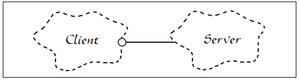
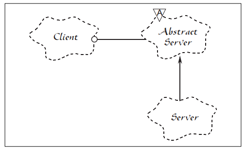

# SOLID原则之Open-closed principle（开放封闭原则）

## 开放封闭原则描述

符合开放封闭原则的模块都有两个主要特性：
1. 它们 "面向扩展开放（Open For Extension）"。

也就是说模块的行为是能够被扩展的。当应用程序的需求变化时，我们可以使模块表现出全新的或与以往不同的行为，以满足新的需求。

2. 它们 "面向修改封闭（Closed For Modification）"。

模块的源代码是不能被侵犯的，任何人都不允许修改已有源代码

看起来上述两个特性是互相冲突的，因为通常扩展模块行为的常规方式就是修改该模块。一个不能被修改的模块通常被认为其拥有着固定的行为。那么如何使这两个相反的特性共存呢？

**抽象**是关键。

在使用面向对象设计技术时，可以创建固定的抽象和一组无限界的可能行为来表述。这里的抽象指的是抽象基类，而无限界的可能行为则由诸多可能衍生出的子类来表示。为了一个模块而篡改一个抽象类是有可能的，而这样的模块则可以对修改封闭，因为它依赖于一个固定的抽象。然后这个模块的行为可以通过创建抽象的衍生类来扩展。

## 示例
### Client/Server引用

如图所示，`Client` 和 `Server` 类都是具体类（Concrete Class），所以无法保证 `Server` 的成员函数是虚函数。 这里 `Client` 类使用了 `Server` 类。如果我们想让 `Client` 对象使用一个不同的 `Server` 对象，那么必须修改 `Client` 类以使用新的 `Server` 类和对象。


在上图的示例中，`AbstractServer` 类是一个抽象类，并包含一个纯虚成员函数。`Client` 类依赖了这个抽象，但 `Client` 类将使用衍生的 `Server` 类的对象实例。如果我们需要 `Client` 对象使用一个不同的 `Server` 类，则可以从 `AbstractServer` 类衍生出一个新的子类，而 `Client` 类则依然保持不变。


### Shape抽象
我们有一个应用程序需要在标准 GUI 窗口上绘制圆形（Circle）和方形（Square）。圆形和方形必须以特定的顺序进行绘制。圆形和方形会被创建在同一个列表中，并保持适当的顺序，而程序必须能够顺序遍历列表并绘制所有的圆形和方形。

下面这段代码展示了符合开放封闭原则的 Cicle/Square 问题的一个解决方案。

```Java
public abstract class Shape {
    public abstract void Draw();
}

public class Circle : Shape {
    public override void Draw() {
      // draw circle on GUI
    }
}

public class Square : Shape {
    public override void Draw() {
      // draw square on GUI
    }
}

public class Client {
    public void DrawAllShapes(List<Shape> shapes) {
        foreach (var shape in shapes) {
            shape.Draw();
        }
    }
}
```
上述例子创建了一个 `Shape` 抽象类，这个抽象类包含一个纯虚函数 `Draw`。而 `Circle` 和 `Square` 都衍生自 `Shape` 类。

当需要扩展 `DrawAllShapes` 函数的行为来绘制一个新的图形种类，所需要做的就是增加一个从 `Shape` 类衍生的子类。而`DrawAllShapes` 函数则无需进行修改。因此`DrawAllShapes` 符合了开放封闭原则，它的行为可以不通过对其修改而扩展。

在比较现实的情况中，`Shape` 类可能包含很多个方法。但是在应用程序中增加一个新的图形仍然是非常简单的，因为所需要做的仅是创建一个衍生类来实现这些函数。同时，我们也不再需要在应用程序内查找所有需要修改的位置了。

## 策略性的闭合（Strategic Closure）
完全闭合是不现实的，所以必须讲究策略。也就是说，程序设计师必须甄别其设计对哪些变化封闭。这需要一些基于经验的预测。有经验的设计师会很好的了解用户和所在的行业，以判断各种变化的可能性。然后可以确定对最有可能的变化保持开放封闭原则。

一个排序策略就是，给定任意两个对象，可以发现哪一个应当被先绘制。因此，我们可以在 `Shape` 中定义一个名为 `Precedes` 的方法，它可以接受另一个 `Shape` 作为参数并返回一个 `bool` 类型的结果。如果结果为 `true` 则表示接收调用的 `Shape` 对象应排在被作为参数的 `Shape` 对象的前面。

我们可以使用重载操作符技术来实现这样的比较功能。这样通过比较我们就可以得到两个 `Shape` 对象的相对顺序，然后排序后就可以按照顺序进行绘制。

下面显示了简单实现的代码。
```Java
public abstract class Shape {
    public abstract void Draw();
    public bool Precedes(Shape another) {
        if (another is Circle)
            return true;
        else
            return false;
    }
}

public class Circle : Shape {
    public override void Draw() {
      // draw circle on GUI
    }
}

public class Square : Shape {
    public override void Draw() {
      // draw square on GUI
    }
}

public class ShapeComparer : IComparer<Shape> {
    public int Compare(Shape x, Shape y) {
      return x.Precedes(y) ? 1 : 0;
    }
}

public class Client {
    public void DrawAllShapes(List<Shape> shapes) {
        SortedSet<Shape> orderedList = new SortedSet<Shape>(shapes, new ShapeComparer());
        foreach (var shape in orderedList) {
            shape.Draw();
        }
    }
}
```
### 使用 "数据驱动（Data Driven）" 的方法来达成闭合

使用表驱动（Table Driven）方法能够达成对 `Shape` 衍生类的闭合，而不会强制修改每个衍生类。

下面展示了一种可能的设计。
```Java
private Dictionary<Type, int> _typeOrderTable = new Dictionary<Type, int>();

private void Initialize() {
      _typeOrderTable.Add(typeof(Circle), 2);
      _typeOrderTable.Add(typeof(Square), 1);
}

public bool Precedes(Shape another) {
      return _typeOrderTable[this.GetType()] > _typeOrderTable[another.GetType()];
}
```
通过使用这种方法我们已经成功地使 `DrawAllShapes` 函数在一般情况下对排序问题保持封闭，并且每个 `Shape` 的衍生类都对新的 `Shape` 子类或者排序策略的修改（例如修改排序规则以使先绘制 Square）等保持封闭。
## 总结

关于开放封闭原则（*Open Closed Principle*）还有很多可以讲的。在很多方面这个原则都是面向对象设计的核心。始终遵循该原则才能从面向对象技术中持续地获得最大的益处，例如：可重用性和可维护性。同时，对该原则的遵循也不是通过使用一种面向对象的编程语言就能够达成的。更确切的说，它需要程序设计师更专注于将抽象技术应用到程序中那些趋于变化的部分上。

## 参考资料
[开放封闭原则（Open Closed Principle）](https://www.cnblogs.com/gaochundong/p/open_closed_principle.html)